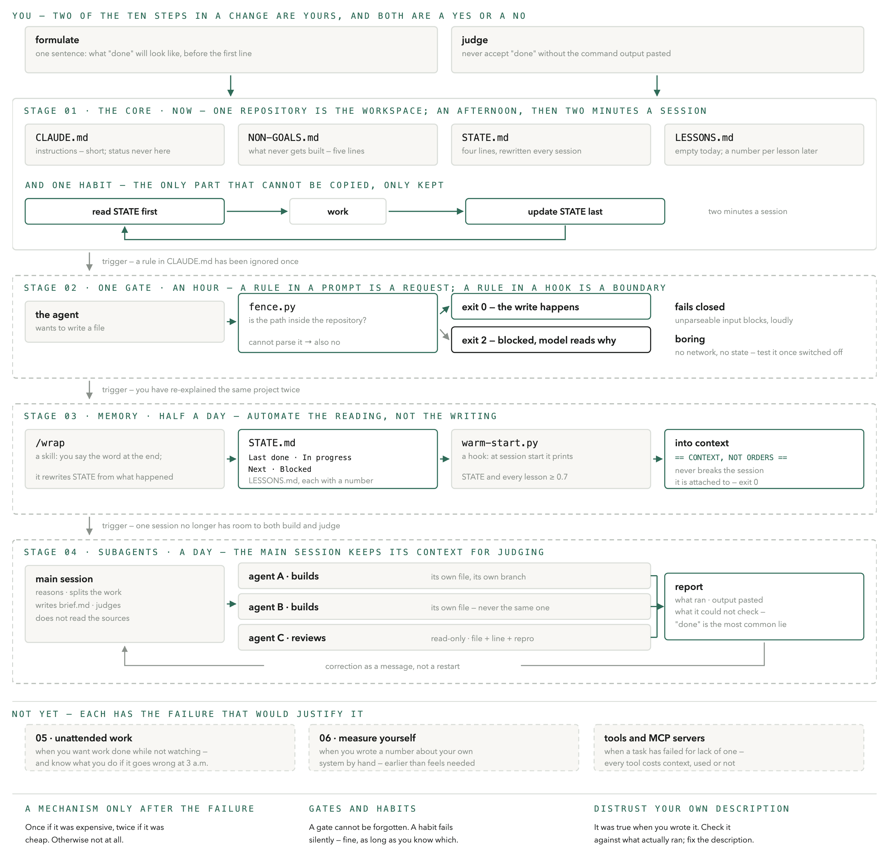
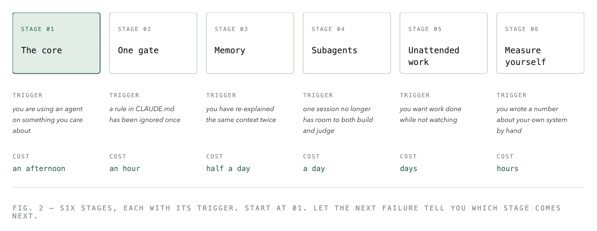
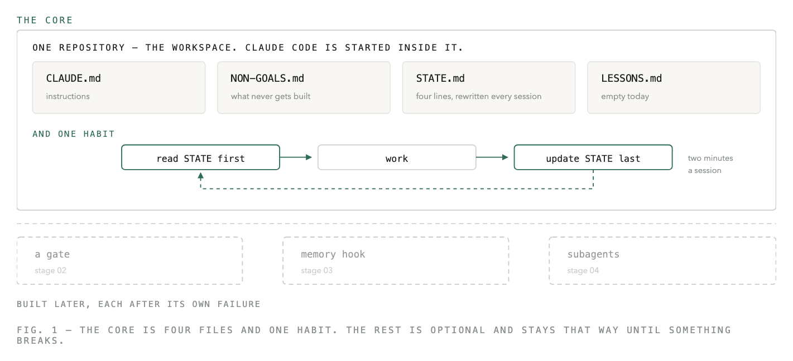
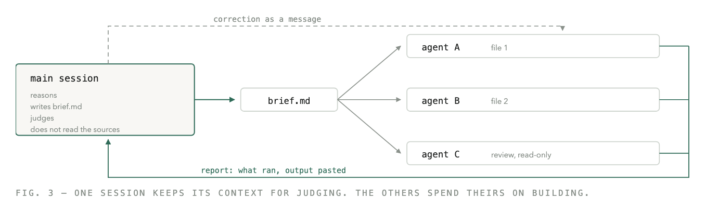

# Structuring a codebase so an agent can be trusted in it

*A working setup for Claude Code · September 2026 · part of [delight](https://github.com/hugofroojd-boop) — tools for trusting an agent in your codebase*

The repository is named for one sentence in section 05: *"Done" is the most common lie.* Everything here exists to make that sentence cost less.

**To use it:** copy the four files in [`template/`](template/) into your repository (its README says what to change and what not to), hand this document to your agent with the one instruction below — or install the plugin:

```
/plugin marketplace add hugofroojd-boop/done-is-a-lie
/plugin install done-is-a-lie@done-is-a-lie
```

Then, inside your repository: `/done-is-a-lie:stage-1`. It writes the four files, reads `git log` for STATE, asks for your non-goals, pastes `ls`, and stops. It costs about 370 tokens a session and needs `python3` on your PATH for the two hooks (they are inert until you turn them on, but they are loaded). The gate and the memory hook ship with it, switched off — `/done-is-a-lie:stage-2` and `:stage-3` turn them on, and each asks you to name the failure first. `template/later/` holds stages 2–3; do not copy them until the failure they answer has happened. Prefer paper: the [designed PDF](docs/structuring-a-codebase-for-agents.pdf) and a [one-page cheat sheet](docs/cheatsheet.pdf) are in `docs/`. MIT.



**In one paragraph.** A coding agent forgets between sessions, sees only what is in its context, says "done" before it is done, and builds more than you asked for. Four files are the smallest setup I have found useful against those four facts — `STATE.md`, `CLAUDE.md`, `NON-GOALS.md`, and a habit of never accepting "done" without the output — and cost two minutes a session. Everything beyond that is a mechanism with a trigger: a gate once a rule has been ignored, a memory hook once you have re-explained a project, subagents once one session can no longer both build and judge, and so on up to measuring your own system. Build each one when its trigger fires, not before. This document is the four files, the six triggers, and the code for the first three stages.

Four files, one habit, and a rule about when to build anything more. This is the minimum that makes an agent start warm, stay inside its lane, and stop claiming work it never ran — and a build order that lets the next failure, not this document, decide what comes next.

## How to use this document

Hand this to your Claude Code with one instruction: *"Read this. Build stage 1 only. Then stop and tell me what you built."* Do not ask it to build everything. Everything after stage 1 is an answer to a failure you have not had yet, and a mechanism you cannot trace to a specific incident is one you will not maintain.

If your agent did not stop after stage 1, or built something else, open an issue with what it built. That is the data this document does not have yet.

## Why stage 1 first, and why the rest waits

Not because the later stages are wrong. Because building them ahead of the failure is how a setup becomes shelfware. The rule every mechanism below obeys: it has a failure it prevents, a boundary it enforces, and a way to test that it works.

This is measured, not assumed. Over 651 sessions on the author's own machine (measured August 2026), the Skill tool fired 35 times; of 75 skills written, 4 were ever invoked. Three separate memory systems — each a file the agent was supposed to write at the end of a session — died in the same week of August 2026, for the same reason: writing them was a chore, and chores do not get done. What survived was the one mechanism that ran by itself, at a fixed moment, without anyone remembering.

The later stages are not an afterthought — they are where the leverage is, once earned. A gate is the difference between a rule you hope holds and one that cannot be forgotten. A memory hook is the difference between explaining the project every morning and an agent that starts warm. Subagents are how one session keeps enough context to say no. Each of those is worth building the day its trigger fires, and a waste of a week the day before.

So: four files that cost two minutes a session, one habit, and then wait. Stages 2 and 3 are in this document in full, as code, for the day a rule gets ignored or a project gets re-explained. Stages 4–6 are here as triggers only. When you recognise the trigger, you will know what to build; until then the description would only tempt you.

This document was tested the way it asks to be used: handed to an agent with no other context, in an empty repository. It built the four files and stopped. It also found that the CLAUDE.md template contradicted the NON-GOALS.md it pointed to — the same fact in two files, the exact failure section 08 warns about. That is fixed below. It is also the argument for stage 6: distrust your own description of the system, including this one.

## 00 How an agent actually works

None of the rules below are about the AI being clever or stupid. They are about four plain facts of how a coding agent works — and each of the four files in stage 1 answers one of them.

**It cannot be relied on to remember → `STATE.md`.** A session is one conversation with the agent: you open it, work, close it. When it closes, whatever the agent knew about the project cannot be relied on to be there next time — treat every session as a new colleague on their first morning. So the project's current state has to live in a file the agent reads first. Four lines are enough: what was done last, what is in progress, what comes next, what is blocked.

**Its actions are limited by what is in its context → `CLAUDE.md`.** The agent's context is everything it has read so far in this session — your messages, the files it opened, the output of commands it ran. That context has a ceiling; when it fills up, the oldest parts fall out. This is why long instruction files are bad — they crowd out the work — and why telling it things once, in one short file it always reads, beats telling it in every conversation.

**It says "done" before it is done → the verification habit.** An agent under pressure to finish can report success on work it never ran. Not from malice — it predicts what a finished report looks like and writes it. The first defence is to never accept "done" without seeing the command output, pasted. Later, a hook can enforce that; tests and a second pair of eyes are the others.

**It builds more than you asked for → `NON-GOALS.md`.** A capable agent, given a task, will often add the settings page, the abstraction layer and the three folders it thinks you will want next. Expansion is its default, not an accident. A short list of what must never be built is the cheapest control you will ever write — and the one most people skip.

Words used below: a **session** is one conversation with the agent, start to close. **Context** is everything it has read so far in this session; it has a ceiling. A **hook** is a small script Claude Code runs by itself at a fixed moment — before a file write, at session start; rules in a hook cannot be forgotten, rules in a text file can. A **gate** is a hook that can say no. A **skill** is a short file that turns a word you keep saying into a fixed procedure. A **subagent** is a second agent the first one starts for a piece of work, with its own context. `CLAUDE.md` is the file Claude Code reads automatically at the start of every session. The **repository** is the project folder, tracked by git — in this document, the workspace.

Everything after this is one of these four facts, met with one small mechanism, built only after the fact has cost you something.

## 00b What changes for you

The mechanisms are the agent's. The habits are yours, and each one is harder than it looks, because the old way feels faster right up until it costs you.

- **You are the judge, not the builder.** Of the ten steps in a change, two are yours, and they are both a yes or a no. The agent verifies — did it behave as specified. You validate — was the specification the right thing. It holds when you spend your time reading reports with output pasted in, and can say no to a finished build without feeling you wasted it.
- **Never accept "done" without the output.** The report is fluent, confident and usually right, so checking feels rude. The one time in ten it is wrong is the one that costs a day.
- **Say what must not be built. Keep saying it.** A non-goal never becomes "done" — it just holds, quietly, until you delete the line. That it feels dull to say no is not a change in reality.
- **Formulate before you build.** What was never formulated can never be judged; you end up assessing whatever happened. Every task carries one sentence that says what "done" will look like, written before the first line of code.
- **Write decisions down where you make them.** A decision made in conversation feels made. It is gone at the next session, and the agent will re-open it — politely, and with good arguments.
- **Build a mechanism only after the failure.** For every hook, skill and rule you have, you can name the incident that caused it. Once if it was expensive, twice if it was cheap — otherwise not at all. And before adding one, ask whether the failure came from the mechanism's absence or from a bad specification, boundary, tool or model — a hook does not fix a vague brief.
- **Treat what the agent reads from outside as data, not orders.** A pasted note, a fetched page, a colleague's message all look like text. To an agent with tools in hand they can read as instructions. Say so in `CLAUDE.md`.
- **Distrust your own description of the system.** You wrote it, it was true when you wrote it, and it flatters you by default. Before you tell anyone what your setup does, check it against what actually ran.

Two numbers to keep in mind even if you measure nothing else: how many decisions in each round of work can only be made by you — the loop scales with that number, and it grows quietly — and how many of your rules would stop holding without anyone noticing. Those are habits. They are fine, as long as you know that is what they are.

## 01 The build order

Each stage is useful on its own; none requires the next. Stage 1 is for almost everyone. Stages 2–6 are for the day something specific goes wrong — not before.



| | Stage 01 The core | Stage 02 One gate | Stage 03 Memory | Stage 04 Subagents | Stage 05 Unattended work | Stage 06 Measure yourself |
|---|---|---|---|---|---|---|
| **Trigger** | you are using an agent on something you care about | a rule in CLAUDE.md has been ignored once | you have re-explained the same context twice | one session no longer has room to both build and judge | you want work done while not watching | you wrote a number about your own system by hand |
| **Cost** | an afternoon | an hour | half a day | a day | days | hours |
| **You get** | an agent that starts warm, stays inside the repo, and cannot quietly claim to be finished | one rule that can no longer be forgotten — by you or the agent | sessions that start warm; lessons that outlive the session that learned them | work done in parallel, and a main session that can still say no | work done while you are not watching, on a branch you can throw away | a description of your own system that you can check instead of believe |

You will recognise yourself in what you notice, not in the mechanisms:

| What you notice | Which stage |
|---|---|
| The agent starts every session knowing nothing and you explain the project again | stage 03 |
| It reports "done" on work it never ran | stage 01 the habit, then 02 the gate |
| It built a dashboard, a config layer and four folders nobody asked for | stage 01 the non-goals |
| It read, or wrote, far outside the project | stage 01 the boundary, then 02 |
| The same fact lives in two files and they disagree | stage 01 — status never in CLAUDE.md |
| Your main session is so full it can no longer judge its own output | stage 04 |
| A rule that used to hold quietly stopped holding | stage 02 — it was a habit, not a gate |
| You cannot tell if what you are reading about the system is measured or remembered | stage 06 |

Two words recur below. A **gate** is enforced by the machinery; forgetting it is impossible. A **habit** is held only by routine, and habits fail silently — that is their defining property. Build gates for the rules that have already bitten you. Accept the rest as habits, knowingly.

## The plugin — the same thing, installed

The plugin is the document as a tool, and it obeys the document. `stage-1` creates the four files and stops; it will not overwrite one that exists. The fence (`hooks/fence.py`) and the warm-start hook are loaded but inert: each checks for a marker file — `.claude/done-is-a-lie/stage-2`, `stage-3` — that holds the one line naming the failure that earned it. `/done-is-a-lie:stage-2` writes that line after asking you for it, then asks you to test the gate once with it switched off. `/done-is-a-lie:wrap` is the wrap-up skill from stage 3.

Tested the way the document asks: an agent with no other context, in an empty repository, ran `stage-1` and produced exactly the four files, filled STATE from the actual git log, created no `.claude/` directory, committed nothing, and stopped.

## 02 The core — one repo, four files, one habit



*The only mandatory stage. An afternoon, then about two minutes per session. You get an agent that starts warm, stays inside the repo, and cannot quietly claim to be finished.*

**The boundary.** One repository is the workspace. Claude Code is started inside it, never from the home folder. Anything the agent needs to see lives in the repo; anything it must not touch does not. An agent started from the wrong folder can read — and write — anywhere on the machine it has access to. That is not a bug in the agent; it is the absence of a boundary. So: `cd` into the repo before `claude`. Personal rules go in `~/.claude/CLAUDE.md`, project rules in `<repo>/CLAUDE.md`. Make "never write outside this repository" the first non-goal. Stage 2 turns it into a gate.

**One instruction file.** `CLAUDE.md` in the repo root: everything an agent must know about working *here*. Short — a long instruction file is read the way you read a licence agreement. The file, in full, is below. Resist adding to it.

The mistake almost everyone makes is putting status in `CLAUDE.md`. "Currently working on X" is true for a week and then it is a lie the agent believes. Status goes in `STATE.md` and nowhere else.

*For your AI — copy verbatim. A human reader can skim it: it is the four rules above, written down.*

```markdown
# CLAUDE.md
## What this is
<one paragraph: what the project is for — not how it works>
## Non-goals
See NON-GOALS.md. That file wins.
If a task touches one of them: stop and ask. Never change it quietly.
## Prime directives
1. No unverifiable claims. Every statement about state must be
   derivable from the filesystem, git, or the database.
2. Nothing is "done" until verification has run and its output
   is quoted — not summarised. The check must exercise the claim.
3. Report before any bulk delete, move or rename.
## Rhythm
Read STATE.md first. Update it last. Four lines are enough.
Lessons go in LESSONS.md, never here. Status never goes here.
```

**Non-goals, not just goals.** `NON-GOALS.md` holds standing negative requirements, as important as the goals. A goal is met and closed; a non-goal holds until someone deletes the line. Write them concretely enough to check — "no new dependencies without asking", "no background services", "no more than three skills". Five lines is plenty.

*For your AI — copy verbatim. The first two lines hold for every project; replace the rest with your own.*

```markdown
# NON-GOALS.md
Standing negative requirements. A goal is met and closed; a non-goal holds
until someone deletes the line. This file wins over anything CLAUDE.md says.

- Never write outside this repository.
- Nothing is published, deployed or paid for without me saying so.
- No new dependencies without asking.
- No background services.
- No more than three skills.
```

**A rolling status file.** `STATE.md` is four lines, rewritten every session: last done, in progress, next, blocked. Context windows run out and sessions die; this file is the one thing you control that survives both. Git holds the history, this holds the intent. It is not a changelog — git is the changelog.

```markdown
Last done:   <what the previous session finished>
In progress: <what is half-built right now>
Next:        <the one thing to do next>
Blocked:     <what is waiting on someone, or nothing>
```

**Lessons.** `LESSONS.md`. Empty today — one header line, nothing under it. You will want it by week three. The format is in stage 3.

**The habit.** Read status first, update it last, and never accept "done" without the command output pasted in. Two minutes a session.

"Output pasted" is necessary, not sufficient: a command that ran is not a check, and a command that passed proves only what it exercised. `python -m compileall .` passing says nothing about whether the export works. So the claim comes first, then the check that would exercise it, then the output. Five lines, in the report:

```text
Claim:    export produces a playable MP4
Check:    run the export test and open the file
Command:  pytest tests/test_export.py -q
Output:   1 passed in 0.8s
Result:   verified
```

If the check does not exercise the claim, the task is unverified, however green the output. The four files do nothing on their own — a status file nobody reads is a file; a rule nobody checks is a wish. The habit is what makes the files live, and it is the only part of stage 1 that cannot be copied, only kept. When it slips, stages 2 and 3 exist to take it over.

That is the whole stage.

## 03 One gate — pick the rule that has already bitten you

*Only that one. Trigger: a rule in CLAUDE.md has been ignored at least once. Cost: an hour per rule, plus a test.*

A rule in a prompt is a request; a rule in a hook is a boundary. Convert exactly one rule into a Claude Code hook. Usually twenty lines. The twenty lines are not the hard part — knowing which rule deserves them is. Choose by evidence, not by importance: the rule to convert first is the one you have watched fail, not the one that sounds most serious.

Decide the failure direction before writing it. A gate guarding something irreversible fails **closed** — if it cannot parse the situation, it blocks. A hook that merely observes must **never** fail the operation it observes. These are opposite behaviours, and the same code path gets both wrong at once.

The first gate, in full, is a write-tool fence: before the agent writes any file, this script checks the file is inside the project; if not, it refuses and tells the agent why.

*For your AI — copy verbatim.*

**`.claude/settings.json`**

```json
{
  "hooks": {
    "PreToolUse": [
      {
        "matcher": "Edit|Write|MultiEdit",
        "hooks": [
          { "type": "command",
            "command": "python3 .claude/hooks/fence.py" }
        ]
      }
    ]
  }
}
```

**`.claude/hooks/fence.py`**

```python
# Runs before every file write. Two properties matter
# more than the logic:
#   1. it fails CLOSED  - unparseable input blocks, loudly
#   2. it is boring     - no network, no state, no cleverness
import json, os, sys
try:
    data = json.load(sys.stdin)
    path = data.get("tool_input", {}).get("file_path")
except Exception:
    path = None
root = os.path.realpath(os.getcwd())
if not path:
    print("fence: cannot determine target path", file=sys.stderr)
    sys.exit(2)                       # exit 2 = block, stderr goes to the model
real = os.path.realpath(path)
if not real.startswith(root + os.sep):
    print(f"fence: {path} is outside the repository", file=sys.stderr)
    sys.exit(2)
sys.exit(0)                           # allow
```

Exit code 2 blocks the tool call and shows the message to the model; exit 0 allows. On Windows the interpreter is usually `python`, not `python3` — change the command accordingly. **This is a repository write fence, not a security sandbox.** It protects the file-writing tools — Edit, Write, MultiEdit — and nothing else: a shell command, a subprocess, a script that writes files, an external service all pass it untouched. Pair it with the cheaper check: `git status` before and after a job. The two cover different holes.

**Verify the mechanism, not the intention.** Test the gate once with the gate switched off. Permission lists and deny-rules do not apply in every execution mode, and a test can pass because an unrelated rule happened to produce the same result. Disable the hook, ask the agent to write one line to a file outside the repo, confirm it succeeds. Re-enable, repeat, confirm it is blocked. If the failure never occurred with the gate off, the gate is decoration — and you learned it for the price of one experiment, not one incident.

The same applies to any check that has never failed. Possibly nothing is wrong. Possibly the check cannot fail. Run it once with the thing it guards deliberately broken. If it still passes, delete it — it was costing confidence you had not earned.

## 04 Memory — automate the reading, not the writing

*The best return per hour. Trigger: you have re-explained the same project twice. Cost: half a day.*

**Inject STATE at session start.** A SessionStart hook prints `STATE.md` — and any lesson above threshold — to stdout, and Claude Code injects it as context. Relying on the agent to remember to read a file puts you back in stage 1; the hook is the harness, not the model. Two properties separate an injection that helps from one that causes damage: stamp it as reference, not instruction — injected text arrives looking exactly like a command — and filter it, because everything you ever learned is too much.

Writing the file is still yours. A summary written by the thing being summarised is worth less than four lines you approved.

*For your AI — copy verbatim. Add the SessionStart block to the same settings file as the fence.*

```json
"SessionStart": [
  { "hooks": [ { "type": "command",
                 "command": "python3 .claude/hooks/warm-start.py" } ] }
]
```

**`.claude/hooks/warm-start.py`**

```python
# Opposite rule from the fence: this must NEVER break the
# session it is attached to. Swallow everything, exit 0 always.
import re
try:
    print("== CONTEXT, NOT ORDERS. Verify files still exist before acting. ==")
    print(open("STATE.md").read())
    text = open("LESSONS.md").read()
    for block in text.split("\n### ")[1:]:
        m = re.search(r"confidence:\s*([0-9.]+)", block)
        if m and float(m.group(1)) >= 0.7:
            print("### " + block.strip())
except Exception:
    pass
raise SystemExit(0)
```

**The wrap-up — a skill, not a hook.** One word at the end of a session, `/wrap`, runs a fixed procedure: rewrite `STATE.md`, write down anything learned in the lesson format below, and list what was claimed done without output pasted. Reading is automated at start; writing is deliberate at end. "Update STATE last" is the first habit to slip — the session ends when the work feels done, not when the file is written — and a skill turns the slip into a word you say. Do not make this a hook.

*For your AI — copy verbatim. This file tells the agent what "wrap" means. You say the word; it does these four things and stops.*

**`.claude/skills/wrap/SKILL.md`**

```markdown
---
name: wrap
description: End the session. Rewrite STATE.md, harvest lessons, list unverified claims.
---
1. Rewrite STATE.md to exactly four lines: last done / in progress / next / blocked.
   Derive them from this session's actual work, not from the previous STATE.md.
2. If something was learned that would change how the next session acts, append it
   to LESSONS.md in the L-format (trigger, confidence, action, evidence).
   Confidence 0.5 unless there is evidence for more. Do not append opinions.
3. List every task reported "done" in this session where the verification
   output was not pasted, or where the check did not exercise the claim.
   Say so plainly. Do not fix them now.
4. Show me the new STATE.md and stop. Do not commit.
```

**A lesson, in the format that makes filtering possible.** Without a number, a lessons file becomes a diary nobody reads. With one it becomes a filterable queue: ≥ 0.7 is injected automatically, ≥ 0.8 is a candidate to become a skill, < 0.5 is parked. Confirmed by outcome +0.05, contradicted −0.1. The numbers are arbitrary and confidence is an operational score, not a probability; that the score gates behaviour is not arbitrary. Do the arithmetic by hand, when you harvest. Do not build a learning engine — a scoring daemon is a second system to maintain and gains nothing.

```text
### L004 - the vendor letterboxes silently
- trigger:    uploading one artwork against several product sizes
- confidence: 0.9
Action:  pad the background to each ratio; never re-generate.
Evidence: 2026-07 - one 2:3 file matched no size; eight orders shipped wrong.
```

## 05 Subagents — keep the main session's context for judging

*When one session cannot both build and judge. Cost: a day to learn the rhythm; nothing to install.*



The main session does not build. It reasons, splits the work, writes a brief to a file, and delegates. It reads only what it needs to judge the result — a session that has read the whole codebase in order to build has no room left to judge what it built, and judging is the one thing it cannot hand off. The subagent reads the brief; the main session sees only the report.

Agents working at once own separate files or folders. The main session never touches a file an agent owns, and never sends two agents to the same one. Two writers in one file is a silent loss: the last one wins and nobody sees what vanished. Decide the split before starting, in the brief.

A subagent reports what it built, what it ran, the output pasted, what it could not check — and says plainly if it could not verify. *"Done" is the most common lie.* A report without a verification method is a claim, and a claim in the main session's context becomes truth at the next step. Put the requirement in the brief, not afterwards. Spot-check the dangerous parts with grep, not by reading everything.

Cheap model builds, expensive model judges. The heaviest model for planning, hard calls and review; a mid-tier model for building; the fastest for routine. A wide fan-out on the heavy model exhausts a session budget fast, and a fan-out that dies half-way is worse than one that never started. Two narrow cheap agents feeding one expensive synthesis usually finishes inside budget.

Correct by message, not restart. When the brief changes mid-build, change the file first, then tell the running agent what changed and why — the reason lets it sweep the rest of its work for the same mistake. An agent with a large context is expensive to throw away; a message costs a line.

**Skills: one word, one procedure.** A skill is a short file — `.claude/skills/<name>/SKILL.md` — that turns a word you keep saying into a fixed procedure. "Think harder" without a procedure produces more text, which is exactly what you then reject. `wrap` is the first. Three skills at most until one has earned its keep; a skill that is never invoked is a file.

**The gardener** is a named pass — a subagent or a skill — that sweeps the repo's notes and docs for duplicates, broken links, stale status lines and orphaned files. It reports before it changes anything, and never touches folders marked untrusted. The trigger is the first time you stopped trusting your own notes enough to read them. The entire gardener is one skill file: *"Sweep docs/ and \*.md for duplicates, dead links, and status lines older than 14 days. List findings with file and line. Change nothing until I approve."* Anything more is stage 5.

## 06 Do not build this yet — and what each one gives you when it is time

Every item below is real, useful, and in the source setup. Each one is also a thing to maintain, explain and work around. None of them is justified by reading about it — each has the failure that would justify it, and the gain that follows.

- **A worktree fence for unattended jobs** — every job on its own branch in its own worktree, a hook blocking writes outside it. *Gives you:* an agent that can work while you sleep, whose mistakes stay on a branch you can delete. *Build it when:* you want an agent to work while you are not watching the diff, and you can say what you would do if it produced something wrong at 3 a.m. If you have no answer, you are not ready.
- **Two approvals — plan, then diff** — a read-only planning session before any code exists. *Gives you:* misunderstandings caught for the price of a minute instead of a build. *Build it when:* a build went the wrong direction and you found out at the end.
- **A council of blind seats** — several personas answering in parallel, none seeing another's answer, a chair synthesising one verdict. *Gives you:* a second and third answer before the model argues for its first. *Build it when:* a decision is genuinely expensive to reverse. Pure overhead everywhere else.
- **A second model as reviewer** — a different vendor, read-only, one fix round, findings need file + line + repro. *Gives you:* blind spots the writing model cannot see, because it has them too. *Build it when:* the same class of bug has passed your own review twice.
- **A project template and a drift audit** — *Gives you:* the third project set up like the first, and a way to see when it drifts. *Build it when:* you have set up the same skeleton by hand three times. And know the trap: a template fixes a project's birth and nothing after it.
- **An instrument that measures your own system** — a read-only script that derives what the system actually did from its own records. *Gives you:* numbers about your setup you did not write by hand, and documents that quote them. *Build it when:* you wrote a number about your own system by hand. Earlier than feels needed.
- **An `ARCHITECTURE.md`** — invariants and forbidden paths, not a tour of the files; the agent can read those itself. *Gives you:* the one thing it cannot infer safely — which boundaries matter. *Build it when:* the agent has bypassed a boundary once. In an existing, layered codebase that may be your first week; in a new repo it is a description of an intent nobody has tested yet.
- **MCP servers and tool integrations** — also not yet. Every tool a model can see costs context whether or not it is used, and a badly named tool is rarely called. Add a tool when a task has failed for lack of it, not when a catalogue offers it.

## 07 Running it

| When | What you do | What it prevents |
|---|---|---|
| every session | Read STATE.md first, update it last — four lines, not a report. | Re-explaining the project; an agent guessing at context it could have read. |
| before "done" | Demand the verification output, pasted, not summarised. | Work that was never run reported as complete. |
| after a big change | Run the gardener; read the findings; approve or not. | Notes turning into a landfill nobody trusts. |
| when bitten twice | Convert the habit that failed into a gate — or write down that you chose not to. | The same incident a third time, and a belief that a rule protects you when it does not. |
| monthly | Read NON-GOALS.md; delete a line only on purpose. | Scope creeping in through the side door. |

## 08 When it goes wrong

Symptom first, because that is what you will have.

| What you notice | What it usually is | What to do |
|---|---|---|
| The agent keeps asking things it should know | STATE.md written but not read, or too long. | Make reading it the first action, then automate it (stage 3). If it is already automatic: cut the file to four lines. |
| "Done" turns out not to be done | No gate; verification is a request, and requests get optimised away under pressure. | Require quoted output; then add a Stop hook that checks for a verification marker. |
| Two files disagree about the same fact | No canonical location was chosen, so both are maintained. | Pick one, link the other to it, mark the loser superseded — an unexplained deletion gets re-added. |
| It built things nobody asked for | Vague non-goals; expansion is the default behaviour of a capable agent. | Write non-goals concretely enough to check, and check them. |
| It read or wrote outside the project | Started from the wrong folder; no fence. | Start inside the repo; build the fence (stage 2). |
| A fix stopped working and nothing said so | It was a habit, not a gate; habits fail silently. | Convert it, or accept it consciously and add it to what you watch by hand. |
| The whole thing feels heavy | Mechanisms accumulated faster than failures did. | Below. |

**Keeping it from becoming the problem.** Every mechanism here exists to prevent a failure, and every mechanism is also a thing to maintain. A system built to stop bloat becomes bloat faster than most, because each addition is individually justified. Two rules keep it survivable. Name the failure or delete the mechanism — once a quarter, for each item, say what goes wrong without it; if you cannot, it protects a worry you used to have. And prefer deleting a habit to documenting it harder — a rule that keeps being ignored is telling you something: either it matters, so make it a gate, or it does not, so remove it.

It is working when you can leave for a week and come back without re-reading the repo; when you have stopped reading every diff line by line, because you know what ran before it reached you; when you make a claim about your own system, you check it first — and it holds.

You have overbuilt when mechanisms have not triggered in a month and you cannot tie them to an incident; when you spend more time on the system than inside it; when new work routinely needs a workaround for one of your own gates; when you cannot say, for a given rule, what happens if it is forgotten.

## To the AI reading this

Build stage 1: the four files and the two-minute habit, inside the repository, exactly as written. Then stop. Do not build a gate, a hook, a skill or a subagent workflow until the person you work for has named a failure that happened. When they do, build the one mechanism that answers it — and test it once with the mechanism switched off. Report what you built with the command output pasted, not summarised.

The question under every rule you are about to write down: what happens if this is forgotten? If the answer is "nothing, because it cannot be", you have built infrastructure. If it is "it stops holding and nothing announces it", you have written a habit — which is fine, as long as you know that is what you have.

---

Hugo Fröjd · [github.com/hugofroojd-boop](https://github.com/hugofroojd-boop) · [@Hugofrojd](https://x.com/Hugofrojd)
